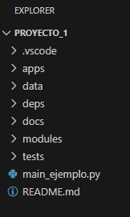

# Repositorio de práctica de Algoritmos y Estructuras de Datos

Repositorio inicial para las clases de práctica de Algoritmos y Estructuras de Datos. En este repositorio se almacenarán los códigos de los trabajos prácticos presentados durante el cursado.

Este repositorio cuenta con una estructura de directorios y módulos que permiten contar con código reutilizable de forma local (todo desde la misma computadora) entre diferentes proyectos de código. Así, por ejemplo, si creas una Lista para un proyecto la misma también puede ser reutilizada fácilmente en otro proyecto sin tener que "copiar y pegar" manualmente.

Para lograr esto último, se provee de un directorio "biblioteca_ayed_fiuner" que funciona como una biblioteca de código reutilizable local.

A continuación se explican los pasos para utilizar y extender los Algoritmos y Estructuras de Datos reutilizables mediante dicha biblioteca local.

## Pasos generales para utilizar esta plantilla
    
1 - Crea tu propio repositorio a partir de la plantilla (botón "Use this template" en GitHub).

2 - Clona el nuevo repositorio en tu computadora.

3 - En VSCode, abre la carpeta del proyecto en que trabajarás, por ejemplo, "/TrabajoPractico_1/proyecto_1/". Verás algo como:
.

4 - Crea un entorno virtual e instala las dependencias necesarias. Asegúrate de añadir la dependencia de la biblioteca local en el archivo "/TrabajoPractico_1/proyecto_1/deps/requirements.txt", es decir, '-e "../../biblioteca_ayed_fiuner"'. El "-e" indica que la instalación de este módulo se realice en modo editable a fin de poder modificar la biblioteca y que los cambios en ella tengan impacto directo en el proyecto que la utiliza. Los "../../" indican subir dos niveles en el árbol de directorios para encontrar el directorio donde está la biblioteca local.

```
pip install -r .\deps\requirements.txt
```

5 - Abre el archivo .py en que trabajás, importa los algoritmos y estructuras de la blioteca y utilízalos. La bilblioteca se importa como "import ayedfiuner".

5.1 - El archivo "/TrabajoPractico_1/proyecto_1/main_ejemplo.py" contiene un ejemplo concreto de cómo realizar esto. Verás dos líneas de código en la parte superior, una para importar un algoritmo de ordenamiento y otra para importar una estructrua de datos.

6 - Si quieres añadir un nuevo algoritmo, debes ingresar al directorio "/biblioteca_ayed_fiuner/ayedfiuner/algoritmos/" de la biblioteca y añadirlo. Por ejemplo, si deseas implementar el algoritmo de ordenamiento rápido podrías crear el archivo "/biblioteca_ayed_fiuner/ayedfiuner/algoritmos/quicksort.py" y dentro implementar el algoritmo "def ordenamiento_rapido(lis)".

7 - Si quieres añadir una nueva estructura de datos, debes ingresar al directorio "/biblioteca_ayed_fiuner/ayedfiuner/estructuras/" de la biblioteca y añadirla. Por ejemplo, si deseas implementar el TAD montículo podrías crear el archivo "/biblioteca_ayed_fiuner/ayedfiuner/estructuras/monticulo.py" y dentro implementar el TAD "class Monticulo".

8 - Una vez que realices las implementaciones de algoritmo y estructruas, estas estarán disponibles a través de las importaciones que toman como raiz "ayedfiuner". Por ejemplo, importar el algoritmo de ordenamiento rápido indicado como ejemplo ser haría con el código "from ayedfiuner.algoritmos.quicksort import ordenamiento_rapido".

## Integrantes del grupo:
    - Apellido y Nombre del primer integrante
    - Apellido y Nombre del segundo integrante

## Cuatrimestre de cursado:
    1er/2do cuatrimestre del 20xx
